# Cómo mostrar esta historia en clase

## 1. Empezar por el código completo

Abre `agente/instrucciones.md` en el tag `v0`. Contiene las instrucciones originales completas. `agente/space.json` contiene las fuentes, ejemplos SQL y 20 preguntas del benchmark. El único marcador de la configuración indica dónde el renderer inserta el contenido del Markdown; no hay un segundo prompt oculto.

V0 tuvo un incidente de arranque antes de evaluar: el runtime Python no definía `__file__`. El commit del fix no cambió la configuración del agente. `v0-evaluacion` identifica el código completo que pudo ejecutar la primera captura. Ambos tags tienen el mismo prompt y configuración.

## 2. Separar cuatro acciones

1. **Commit:** Git registra archivos e hipótesis. Todavía no cambia Databricks.
2. **Plan y apply:** construyen la configuración del commit y actualizan el mismo Space. ETag rechaza una edición concurrente; el export posterior verifica el resultado.
3. **Benchmark:** pregunta 20 veces al agente, compara contra referencias SQL congeladas y conserva los juicios y trazas. No modifica el prompt.
4. **Notebook final:** verifica las tres capturas y compara aciertos, correcciones y regresiones. No hace preguntas nuevas ni cambia el Space.

```mermaid
flowchart LR
  C0[Commit V0] --> D0[Deploy V0] --> E0[Benchmark V0]
  E0 --> R0[Revisar fallos] --> C1[Commit V1]
  C1 --> D1[Deploy V1] --> E1[Benchmark V1]
  E1 --> R1[Revisar fallos] --> C2[Commit V2]
  C2 --> D2[Deploy V2] --> E2[Benchmark V2]
  E2 --> N[Ejecutar notebook final]
```



## 3. Mostrar los cambios

En GitHub abre Compare y filtra por `agente/instrucciones.md`. Los otros archivos del commit documentan evidencia previa y la decisión. Para ver solo el prompt:

```sh
git diff v0-evaluacion v1 -- agente/instrucciones.md
git diff v1 v2 -- agente/instrucciones.md
```

Los commits de V1 y V2 ocurrieron después de analizar el resultado anterior. No son una reconstrucción retrospectiva del historial. El código del evaluador, la rúbrica y las referencias permanecieron fijos durante las tres capturas.

## 4. Volver a un commit para demostrar un rollback

```sh
git switch --detach v1
python deploy/genie_space.py plan --out .local/rollback-v1.json
# Revisar el diff antes de aplicar.
python deploy/genie_space.py apply --plan .local/rollback-v1.json --label rollback-v1
git switch main
```

Esto cambia el prompt/configuración del mismo Space; la URL no cambia. No deshace respuestas, datos ni capturas históricas. Esta secuencia de rollback es una instrucción para clase; no formó parte de las tres evaluaciones registradas de este repo.

No vuelvas a ejecutar `submit.py V1` sobre la evidencia original después del rollback. Para otro experimento usa una carpeta de evidencia nueva y registra una nueva serie; nunca sobrescribas una captura ni repitas hasta obtener una nota deseada.

## 5. Leer correctamente el resultado final

Cada juicio corresponde a una pregunta conocida. Un delta positivo no demuestra generalización, y una aprobación del juez no equivale a validación humana. Revisa especialmente los cálculos nominales que mezclan monedas: pueden responder a una pregunta estadística sin constituir un precio comparable para decisiones de compra.
